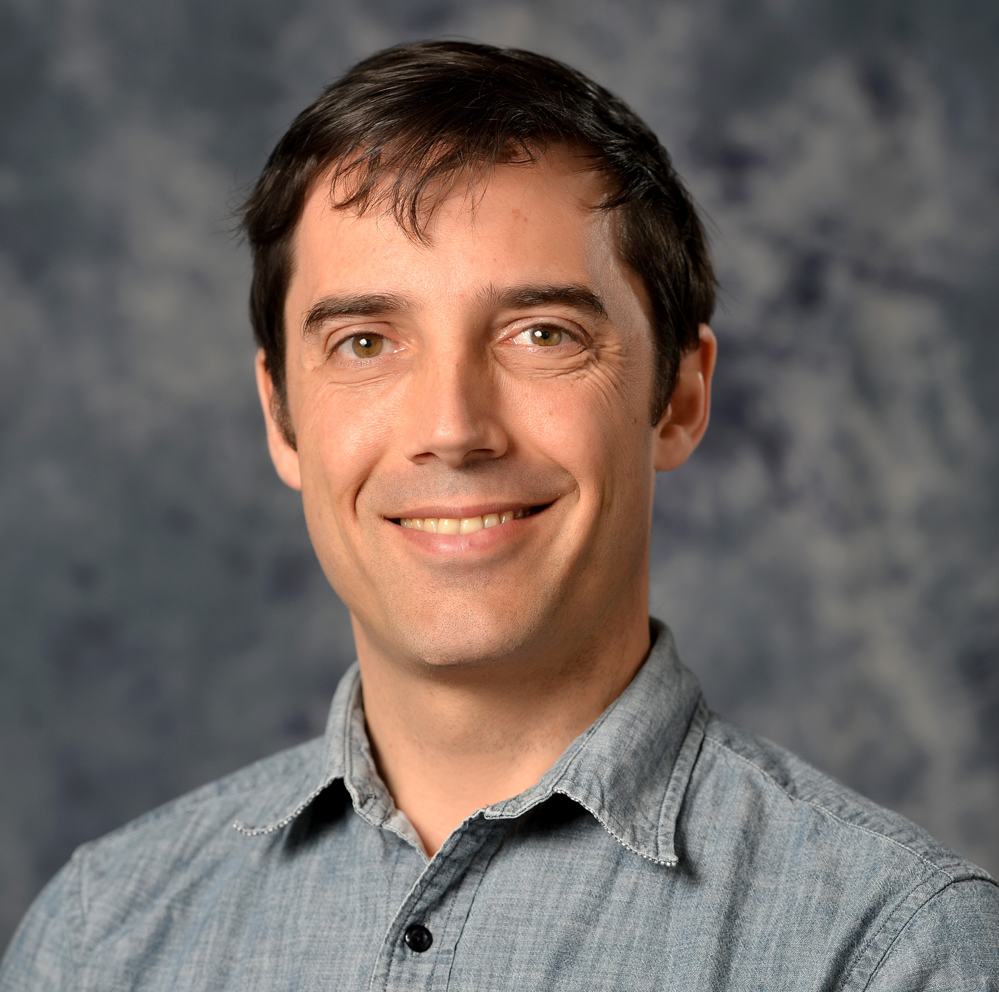

# BioC 2019: Where Software and Biology Connect

When: June 24 - 27, 2019 
What: Developer Day, Main Conference, Symposium 
Where: [NYU and Rockefeller University][venue], New York City, USA 
Slack: [Bioconductor Team][] (`#bioc2019` channel) 
Twitter: [#bioc2019][tweet] 

[tweet]: https://twitter.com/hashtag/bioc2019?f=tweets
[venue]: ./travel-accommodations
[Bioconductor Team]: https://bioc-community.herokuapp.com/

# BioC2019 Code of Conduct violation response

This statement is in response to a complaint of sexual harassment made to the [BioC2019 Code of Conduct committee][1] after the BioC2019 conference. A BioC2019 conference attendee reported unwelcome sexual attention and inappropriate physical contact from an intoxicated conference attendee, during a social gathering of conference attendees.

Since the time when the complaint was made the Committee has followed up with the complainant, the accused, and others present, and sought external advice from persons outside the organization to define procedures to make appropriate decisions to deal with this and future reports of violation of the code of conduct. The committee decided on the following actions:

* The accused will be ineligible to attend Bioconductor conferences for three years following the event (specifically BioC2020, BioC2021, BioC2022).
* In order to attend future Bioconductor conferences after this period, the accused must make a written request to the BioC Code of Conduct Committee.  If the Committee unanimously agrees that the accused no longer presents an elevated risk of future Code of Conduct violations, the accused will again be permitted to attend Bioconductor conferences.
* The accused will be ineligible for future financial support from the Bioconductor organization.

The Code of Conduct Committee undertook these actions with the goal of maintaining a welcoming and harassment-free environment at future conferences. With this goal in mind, we wish to remind all participants that:

* Bioconductor does not tolerate harassment, intimidation, or bullying of conference participants in talks, workshops, poster sessions, social activities, or online. This includes informal gatherings of conference participants outside of formally scheduled activities.
* Sexual attention does not have to be explicitly lewd in order to violate the Code of Conduct, which states simply that unwelcome sexual attention or inappropriate physical contact is harassment. 
* Drunkenness is not an excuse for committing a Code of Conduct violation. Neither is unfamiliarity with the Code of Conduct.
* All conference participants are responsible for treating others in a professional and respectful manner within the bounds of our Code of Conduct. Anyone violating the Code of Conduct, from first-time attendees to senior leaders, will be held accountable.

People generally participate in Bioconductor conferences for professional or academic interest, and expect to interact with colleagues on the primary basis of shared interests in open-source Bioinformatics. Unwanted sexual attention, and other actions forbidden by the [Code of Conduct][1], deny others of this experience. The Code of Conduct committee encourages all conference participants to review the Code of Conduct and to enjoy their time at the conference while remembering their responsibility to maintain a supportive, collegial, and harassment-free conference experience for everyone. Anyone experiencing or witnessing a Code of Conduct violation should report it either to code-of-conduct@bioconductor.org, a member of the Code of Conduct committee, or anonymously at https://tinyurl.com/bioccomplaint. 

This is the first experience the Committee has had with a sexual harassment complaint and part of the reason for the time delay between the complaint and this response been our work on forming , and formed procedures for decision-making in such instances. This complaint was handled by the Bioconductor Code of Conduct Committee (Levi Waldron, Aedin Culhane, Laurent Gatto, Stephanie Hicks) and this response was approved by the [Bioconductor Technical Advisory Board][2]. 

## Respuesta a la violación del Código de Conducta durante BioC2019

Este pronunciamiento es en respuesta al reporte de acoso sexual que recibió el comité de [Código de Conducta de BioC2019][1] después de dicho congreso. Una persona que asistió al congreso a BioC2019 reportó haber sido víctima de atención sexual y contacto físico no deseados por parte de un participante más del congreso que estaba en un estado de intoxicación, durante una reunión social por parte de participantes del congreso. 

Desde que el Comité recibió el reporte, dicho organismo tuvo conversaciones con la persona que hizo el reporte, la persona acusada y personas que atestiguaron el incidente. Además, el Comité pidió asesorías de personas externas a la organización y definió procedimientos para tomar las decisiones apropiadas para lidiar con futuros reportes de violación del código de conducta. El Comité decidió tomar las siguientes acciones:

* La persona acusada no será elegible para asistir a congresos de Bioconductor por tres años después de BioC2019 (específicamente BioC2020, BioC2021 y BioC2022).
* Para poder asistir a congresos de Bioconductor después de este periodo, la persona acusada deberá mandar una solicitud por escrito al Comité del Código de Conducta de BioC. Si el Comité aprueba unánimemente que la persona ya no representa un riesgo elevado de reincidencia de futuras violaciones al Código de Conducta, dicha persona podrá volver a asistir a congresos de Bioconductor.
* La persona acusada no será elegible para recibir apoyo financiero de la organización de Bioconductor en el futuro.

El Comité del Código de Conducta tomó estas acciones con el objetivo de mantener un ambiente acogedor y libre de acoso en futuros congresos. Con este objetivo en mente, les deseamos recordar a todas y todos los participantes que:

* Bioconductor no tolera el acoso o intimidación de participantes del congreso durante pláticas, talleres, sesiones de pósters, actividades sociales, o en línea (de forma virtual). Esto incluye reuniones informales organizadas por participantes del congreso fuera del horario de actividades planeadas.
* La atención sexual no tiene que ser explícitamente lasciva para representar una violación del Código de Conducta, que simplemente establece que la atención sexual no deseada o contacto físico inapropiado es acoso.
* Estar en un estado de intoxicación alcohólica no es una excusa para cometer una violación al Código de Conducta como tampoco lo es el no conocer dicho código.

Las personas generalmente participan en congresos de Bioconductor por intereses profesionales o académicos, donde esperan interactuar con colegas principalmente por el interés en común en código de acceso libre para la Bioinformática. Atención sexual no deseada, entre otras acciones prohibidas por el [Código de Conducta][1], niegan a otras personas ser partícipes de esta experiencia. El Comité del Código de Conducta alienta a todas y todos los participantes del congreso a que revisen el Código de Conducta y que disfruten de su experiencia durante los congresos, recordando su responsabilidad para mantener un ambiente de apoyo, colegial, y libre de acoso para la totalidad de las y los participantes. Cualquier persona que sea víctima o este atestiguando una violación al Código de Conducta deberá reportar dicha violación a code-of-conduct@bioconductor.org, a alguna persona dentro del Comité del Código de Conducta, o anónimamente a través de https://tinyurl.com/bioccomplaint. 

Este reporte fue atendido por el Comité del Código de Conducta de Bioconductor (Levi Waldron, Aedin Culhane, Laurent Gatto, Stephanie Hicks) y la respuesta fue aprobada por la [Junta Asesora Técnica de Bioconductor][2]. 

Traducción al español por Leonardo Collado Torres.

[1]: https://bioc2019.bioconductor.org/code_of_conduct
[2]: https://www.bioconductor.org/about/technical-advisory-board/

# BioC2019 Code of Conduct

## Social media policy

Images and content from talks, workshops, and posters may be shared publicly through social media _unless_ the presenter asks for it not to be. To avoid confusion, presentations not to be shared should be labeled "Do Not Share" on each slide, as should be posters.

## The _Bioconductor_ conference aims to provide a supportive, collegial, and harassment-free environment

_Bioconductor_ is dedicated to providing a supportive, collegial, and harassment-free 
conference experience for everyone, regardless of:
* gender, gender identity and expression, sexual orientation, disability, 
physical appearance, body size, race, age or religion. 
* intellectual position: approaches to data analysis, software preferences, coding style, scientific perspective, etc.

We do not tolerate harassment, intimidation, or bullying of conference participants in talks, 
workshops, poster sessions, social activities, 
or online. Sexual language and imagery is not appropriate for any conference venue, including talks. 
Conference participants violating these rules may be sanctioned or expelled from the conference with no refund, 
at the discretion of the conference organizers. Our anti-harassment policy can be found at: http://bioc2019.bioconductor.org/code_of_conduct

## Examples of unacceptable harassment, intimidation, and bullying behavior

Harassment includes, but is not limited to:

* Making comments, to an audience or personally, that belittle or demean another person
* Sexual images in public spaces
* Stalking or following
* Harassing photography or recording
* Sustained disruption of talks or other events
* Inappropriate physical contact
* Unwelcome sexual attention
* Advocating for, or encouraging, any of the above behaviour 

Intimidation and bullying include, but are not limited to:

* Aggressive or browbeating behavior directed at someone during a public presentation
* Mocking or insulting another person's intellect, work, perspective, or question/comment
* Making reference to someone's gender, gender identity and expression, sexual orientation, disability, 
physical appearance, body size, race, age, religion, or other personal attribute in the context of a scientific 
discussion
* Deliberately making someone feel unwelcome

### Enforcement

Participants asked to stop any harassing behavior are expected to comply immediately.

If a participant engages in harassing behaviour, event organisers retain the right to take any actions to keep the event a welcoming environment for all participants. This includes warning the offender or expulsion from the conference with no refund. 

Event organisers may take action to redress anything designed to, or with the clear impact of, disrupting the event or making the environment hostile for any participants. 

We expect participants to follow these rules at all event venues and event-related social activities. We think people should follow these rules outside event activities too! 

### Reporting

If someone makes you or anyone else feel unsafe or unwelcome, please report it as soon as possible. 
Harassment and other code of conduct violations reduce the value of our event for everyone. 
We want you to be happy at our event. People like you make our event a better place. 

You can make a report either personally or anonymously. 

#### Anonymous or Non-anonymous Report

You can make an anonymous or non-anonymous report here: https://tinyurl.com/bioccomplaint. It is a free-form text box that will be forwarded to conference organizers.

We can't follow up an anonymous report with you directly, but we will fully investigate it and take whatever action is necessary to prevent a recurrence. 

#### Personal Report

You can make a personal report with any of the conference anti-harassment committee: Aedin Culhane, Levi Waldron, and Laurent Gatto.

When taking a personal report, our staff will ensure you are safe and cannot be overheard. They may involve other event staff to ensure your report is managed properly. Once safe, we'll ask you to tell us about what happened. This can be upsetting, but we'll handle it as respectfully as possible, and you can bring someone to support you. You won't be asked to confront anyone and we won't tell anyone who you are. 

Our team will be happy to help you contact hotel/venue security, local law enforcement, local support services, provide escorts, or otherwise assist you to feel safe for the duration of the event. We value your attendance. 

    Conference organizers: workshop@bioconductor.org
    Anonymous complaints: tinyurl.com/bioccomplaint
    Local law enforcement: 911
    Local sexual assault hot line: 212-227-3000

| Photo | Name |
|---|---|---|
|  | Aedin Culhane <[aedin@jimmy.harvard.edu][2]> |
|  | Levi Waldron  <[lwaldron.research@gmail.com][4]> |
|  | Laurent Gatto <[laurent.gatto@uclouvain.be][6]> |

[0]: mailto:workshop@bioconductor.org?subject=BioC2019%20code-of-conduct
[2]: mailto:aedin@jimmy.harvard.edu?subject=BioC2019%20code-of-conduct
[4]: mailto:lwaldron.research@gmail.com?subject=BioC2019%20Code-of-conduct
[6]: mailto:laurent.gatto@uclouvain.be?subject=BioC2019%20Code-of-conduct
